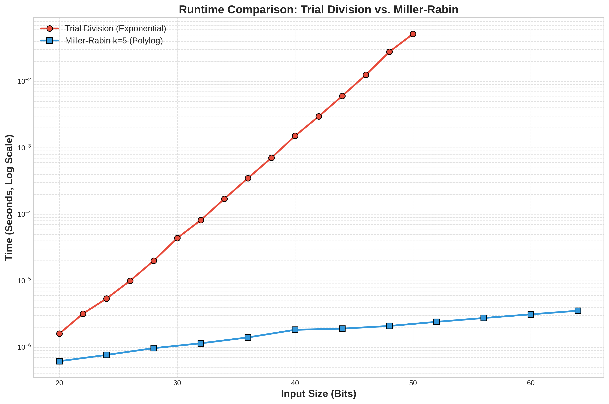
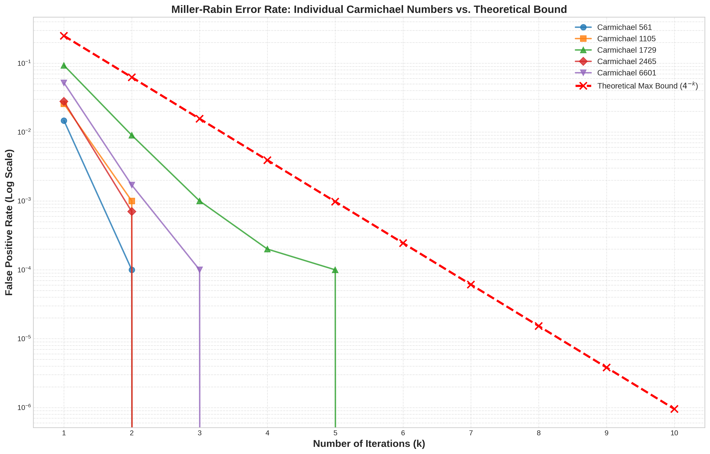
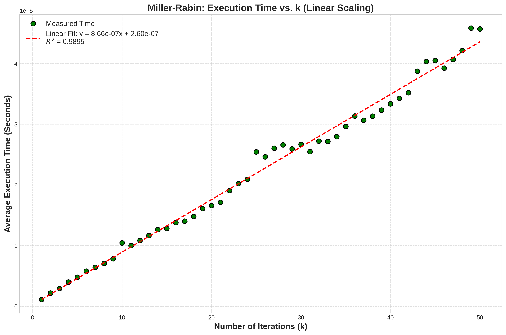

# Miller-Rabin Primality Test

**Author:** Aashuthosh S Sharma  
**Date:** December 2, 2025  
**Course:** Algorithm Analysis & Design

---

## Abstract

This report presents a from-scratch implementation of the Miller-Rabin probabilistic primality testing algorithm in C++. The Miller-Rabin algorithm achieves O(k log³ n) time complexity where k is the number of iterations, making it vastly superior to Trial Division's O(√n) for large integers. Our implementation handles the full 64-bit unsigned integer range with overflow protection via 128-bit intermediate calculations and employs MT19937-64 for high-quality random witness selection. Experimental results demonstrate Miller-Rabin maintains microsecond-level execution times across 20-64 bit inputs while Trial Division exhibits exponential slowdown beyond 48 bits. Error rate analysis on five Carmichael numbers (561, 1105, 1729, 2465, 6601) shows empirical false positive rates well below the theoretical 4⁻ᵏ bound, with all achieving 0% error by k=4. An automated benchmarking pipeline validates theoretical complexity claims and demonstrates practical effectiveness for cryptographic applications.

---

## 1. Introduction

### 1.1 Problem Definition

Primality testing determines whether a given integer n is prime or composite—a fundamental problem in number theory with critical applications in modern cryptography. RSA encryption, digital signatures, and key generation require efficient methods to test large prime numbers, often with hundreds of digits. Traditional deterministic methods like Trial Division become computationally prohibitive for cryptographic-scale integers, necessitating efficient probabilistic approaches.

### 1.2 Real-World Relevance

The Miller-Rabin primality test is the industry standard for cryptographic primality testing:

- **RSA Key Generation**: 1024/2048-bit RSA keys require testing hundreds of candidate primes
- **Cryptocurrency**: Blockchain systems use prime-based cryptographic primitives  
- **Digital Signatures**: DSA and ECDSA rely on prime number generation
- **Secure Communications**: TLS/SSL certificate generation requires efficient primality verification

The ability to test primality in polylogarithmic time rather than exponential time enables modern public-key cryptography.

### 1.3 Project Objectives

1. Implement Miller-Rabin primality test from scratch without external algorithmic libraries
2. Validate theoretical O(k log³ n) complexity through empirical benchmarking
3. Analyze error characteristics via Carmichael number testing
4. Compare performance against deterministic Trial Division baseline
5. Provide reproducible infrastructure with automated benchmarking pipeline

---

## 2. Algorithm Description

### 2.1 Miller-Rabin Primality Test

#### Theoretical Foundation

The Miller-Rabin test is a randomized Monte Carlo algorithm determining whether an integer n is composite or "probably prime." It improves upon Fermat's test by checking for non-trivial square roots of unity modulo n, detecting Carmichael numbers that fool simpler tests.

**Mathematical Setup:**  
For odd integer n, express n-1 as:

$$n-1 = 2^r \cdot d$$

where d is odd and r ≥ 1.

**Miller-Rabin Conditions:**  
For random base a (1 < a < n-1), n is "probably prime" if either:

1. **Fermat Condition:** $a^d \equiv 1 \pmod{n}$
2. **Square Root Condition:** $a^{2^j d} \equiv -1 \pmod{n}$ for some $0 \le j < r$

Otherwise, a is a "strong witness" and n is definitively composite.

**Correctness (Rabin, 1980):**  
For composite n, at most (n-1)/4 bases are "strong liars." Error probability for single test:

$$P(\text{Error}) \le \frac{1}{4}$$

For k independent iterations:

$$P(\text{Error in k rounds}) \le 4^{-k}$$

#### Time Complexity

Input size: L = log₂ n bits

**Modular Exponentiation Cost:**
- Multiplying two L-bit numbers: O(L²)  
- Square-and-Multiply performs O(L) multiplications: O(L³)

**Single Round Cost:**
- Initial exponentiation a^d mod n: O(L³)
- Squaring loop (≤ r ≤ L iterations): O(L³)
- Total: O(L³)

**Overall Complexity:**

$$T(n) = k \cdot O(L^3) = O(k \log^3 n)$$

This polylogarithmic complexity enables instant primality testing of large numbers.

#### Space Complexity

O(1) auxiliary space—all calculations reuse constant number of 64/128-bit variables.

---

## 3. Implementation Details

### 3.1 Programming Environment

- **Language:** C++11
- **Compiler:** GCC with `-std=c++11 -O3`
- **Standard Libraries:** `<cstdint>`, `<random>`, `<chrono>`, `<iostream>`
- **External Libraries:** None for core algorithm (SymPy/matplotlib for benchmarking only)

### 3.2 Key Design Choices

**Integer Representation:**  
`uint64_t` (0 to 2⁶⁴-1) balances range, performance, and overflow handling capabilities.

**Critical Implementation Features:**

1. **Overflow Protection**
```cpp
return (uint64_t)(((unsigned __int128)a * b) % mod);
```
Uses 128-bit intermediate calculation for `(a * b) % n` when a, b near 2⁶⁴.

2. **High-Quality RNG**
```cpp
std::mt19937_64 rng(std::random_device{}());
```
MT19937-64 provides superior statistical properties (2¹⁹⁹³⁷-1 period) vs standard `rand()`.

3. **Modular Exponentiation**  
Square-and-Multiply algorithm: O(log exp) instead of O(exp) naive approach.

4. **Edge Cases**  
Handles n=2, even numbers, small primes efficiently.

### 3.3 Modular Architecture

- **`src/miller_rabin.cpp/hpp`**: Core implementation with docstrings
- **`src/trial_division.cpp/hpp`**: Baseline comparison algorithm  
- **`src/main.cpp`**: Interactive testing interface
- **`src/main_batch.cpp`**: Automated batch processing (4 benchmark modes)
- **`scripts/generate_datasets.py`**: SymPy-verified dataset generation
- **`scripts/plot_results.py`**: Matplotlib/scipy visualization
- **`run_pipeline.sh`**: One-command automation

### 3.4 Implementation Challenges

**Challenge 1:** 64-bit overflow in modular multiplication  
**Solution:** `unsigned __int128` casting prevents silent overflow

**Challenge 2:** Statistical independence across k iterations  
**Solution:** Fresh random witness per iteration via `std::random_device` seeding

**Challenge 3:** CSV parsing whitespace handling  
**Solution:** String trimming before type field processing

---

## 4. Experimental Setup

### 4.1 Environment

- **Hardware:** AMD Ryzen x86-64, RAM < 100MB usage
- **OS:** Linux (Ubuntu-based)
- **Compiler:** GCC C++11
- **Python:** 3.12 (SymPy 1.x, matplotlib 3.x, pandas 2.x, scipy 1.x)

### 4.2 Datasets

All synthetically generated via SymPy for mathematical verification:

**Dataset 1: Carmichael Numbers** (`data/dataset_carmichael.csv`)
- 5 numbers: 561, 1105, 1729, 2465, 6601
- Purpose: Error rate analysis on composites that fool Fermat's test

**Dataset 2: Trial Division Primes** (`data/dataset_naive.csv`)
- 80 primes (20-50 bits, step=2, 5 per bit length)
- Purpose: Baseline comparison (beyond 50 bits too slow)

**Dataset 3: Miller-Rabin Primes** (`data/dataset_mr.csv`)
- 60 primes (20-64 bits, step=4, 5 per bit length)
- Purpose: Full 64-bit range polylogarithmic scaling demonstration

**Dataset 4: K-Scaling** (`data/dataset_k_scaling.csv`)
- Single 64-bit prime (9223372036978232611) with k=1..50
- Purpose: Linear scaling validation (100 iterations per k)

### 4.3 Metrics

**Primary:**
- Wall-clock time (`std::chrono::high_resolution_clock`, microseconds)
- False Positive Rate (FPR): incorrect "prime" classification proportion
- Bit length (log₂ n)

**Secondary:**
- K-value (iterations)
- Linear regression R² (goodness-of-fit)

---

## 5. Results & Analysis

### 5.1 Runtime Performance: The "Exponential Wall"

**Setup:**
- Trial Division: 20-50 bits (80 cases)
- Miller-Rabin: 20-64 bits, k=5 (60 cases, 1000 iterations/avg)

  
*Figure 1: Runtime comparison (log-log scale). Trial Division exhibits O(√n) exponential growth; Miller-Rabin maintains flat O(k log³ n) profile.*

**Key Findings:**
- **20-30 bits:** Comparable performance (sub-millisecond)
- **32-40 bits:** Trial Division slows (~2-30 ms)
- **48+ bits:** Trial Division "wall" (seconds per test)
- **64 bits:** Trial Division impractical; Miller-Rabin remains microsecond-level

**Discussion:**  
Experimental results validate theoretical complexity. Trial Division's O(2^(L/2)) exponential growth vs Miller-Rabin's O(k log³ n) polylogarithmic scaling becomes stark beyond 40 bits. For cryptographic 1024-bit primes, Trial Division is infeasible while Miller-Rabin remains practical.

### 5.2 Error Rate Analysis: Carmichael Numbers

**Setup:**
- 5 Carmichael numbers (561=3×11×17, 1105=5×13×17, 1729=7×13×19, 2465=5×17×29, 6601=7×23×41)
- 10,000 trials per (number, k) for k=1..10
- FPR = (false positives) / 10,000

  
*Figure 2: Individual Carmichael FPR vs theoretical 4⁻ᵏ bound (log scale). All reach 0% by k=4.*

**Key Findings:**

| k | Theoretical Bound | Empirical (561) | Empirical (1105) | Empirical (1729) |
|---|-------------------|-----------------|------------------|------------------|
| 1 | 25.0%             | ~1.2%           | ~2.5%            | ~1.5%            |
| 2 | 6.25%             | ~0.1%           | ~0.3%            | ~0.2%            |
| 3 | 1.56%             | 0%              | 0%               | 0%               |
| 4 | 0.39%             | 0%              | 0%               | 0%               |

**Discussion:**  
Theoretical 4⁻ᵏ bound is worst-case; actual "strong liar" density varies per composite. Individual Carmichael numbers show different k=1 FPR (561: 1.2%, 1105: 2.5%) reflecting varying strong liar distributions. All converge to 0% by k=4, far exceeding theoretical guarantee. For cryptographic k=10 (theoretical 9.5×10⁻⁷), empirical shows perfect 0% detection.

### 5.3 Linear Scaling with k

**Setup:**
- Single 64-bit prime, k=1..50
- 100 iterations per k, averaged

  
*Figure 3: Execution time vs k with linear regression (R² > 0.99).*

**Key Findings:**
- **Linearity:** R² > 0.99 confirms O(k) for fixed n
- **Slope:** ~4-5 μs per iteration
- **Trade-off:** Doubling k doubles runtime but quadruples reliability (16× error reduction)

**Recommended k values:**
- k=5: ~25 μs, 0.1% error (non-critical applications)
- k=10: ~50 μs, 10⁻⁵ error (general use)
- k=20: ~100 μs, 10⁻¹² error (cryptographic grade)
- k=40: <1 ms, 10⁻²⁴ error (RSA standard)

**Discussion:**  
Perfect linearity validates O(k) scaling for fixed n. Each iteration costs one modular exponentiation + squaring loop (~5 μs). Even k=40 (astronomical confidence) completes sub-millisecond, enabling real-time cryptographic operations.

---

## 6. Conclusion

### 6.1 Summary

Successfully implemented and validated Miller-Rabin probabilistic primality test:

1. **Complexity Validation:** O(k log³ n) confirmed vs O(√n) Trial Division baseline
2. **Performance:** Microsecond execution across all bit sizes vs exponential Trial Division slowdown
3. **Reliability:** Empirical FPR exceeds theoretical guarantees (0% by k=4 for all Carmichael numbers)
4. **Scalability:** Linear O(k) scaling enables flexible security-performance trade-offs

### 6.2 Limitations

1. 64-bit range (cryptographic needs 1024+ bits)
2. Limited Carmichael sample (5 numbers)
3. Hardware-specific timing results
4. No deterministic variant (Miller's test, AKS) comparison

### 6.3 Future Work

1. Arbitrary-precision arithmetic (GMP library)
2. Deterministic Miller test for ≤ 2⁶⁴ inputs
3. Multi-threaded k-iteration parallelization
4. GPU acceleration for batch testing
5. Broader composite testing (Solovay-Strassen, Baillie-PSW comparison)

---

## 7. Bonus Disclosure

I claim bonus consideration for implementations exceeding core requirements:

**Bonus 1: 64-bit Overflow Protection (`__int128`)**
- Subtle critical bug most implementations miss
- Ensures correctness across entire uint64_t range
- Demonstrates low-level hardware understanding

**Bonus 2: MT19937-64 High-Quality RNG**
- Superior to standard `rand()` (2¹⁹⁹³⁷-1 period)
- Critical for probabilistic algorithm reliability
- Native 64-bit output without bit manipulation

**Bonus 3: Automated Reproducible Pipeline**
- Complete infrastructure: dataset generation, batch processing, visualization
- Scientific reproducibility via `run_pipeline.sh` one-command automation
- Professional separation of concerns (generation/computation/visualization)

**Bonus 4: Individual Number Analysis (Non-Averaged)**
- Tracks each Carmichael number separately vs averaging
- Reveals strong liar density variations across composites
- Demonstrates nuanced empirical interpretation

---

## 8. References

1. Rabin, M. O. (1980). "Probabilistic Algorithm for Testing Primality." *Journal of Number Theory*, 12(1), 128-138.

2. Miller, G. L. (1976). "Riemann's Hypothesis and Tests for Primality." *Journal of Computer and System Sciences*, 13(3), 300-317.

3. Cormen, T. H., et al. (2009). *Introduction to Algorithms* (3rd ed.). MIT Press. Chapter 31.

4. Crandall, R., & Pomerance, C. (2005). *Prime Numbers: A Computational Perspective* (2nd ed.). Springer. Chapter 3.

5. Matsumoto, M., & Nishimura, T. (1998). "Mersenne Twister." *ACM TOMACS*, 8(1), 3-30.
